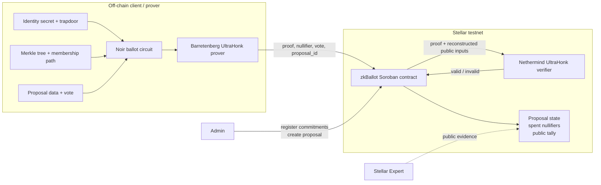
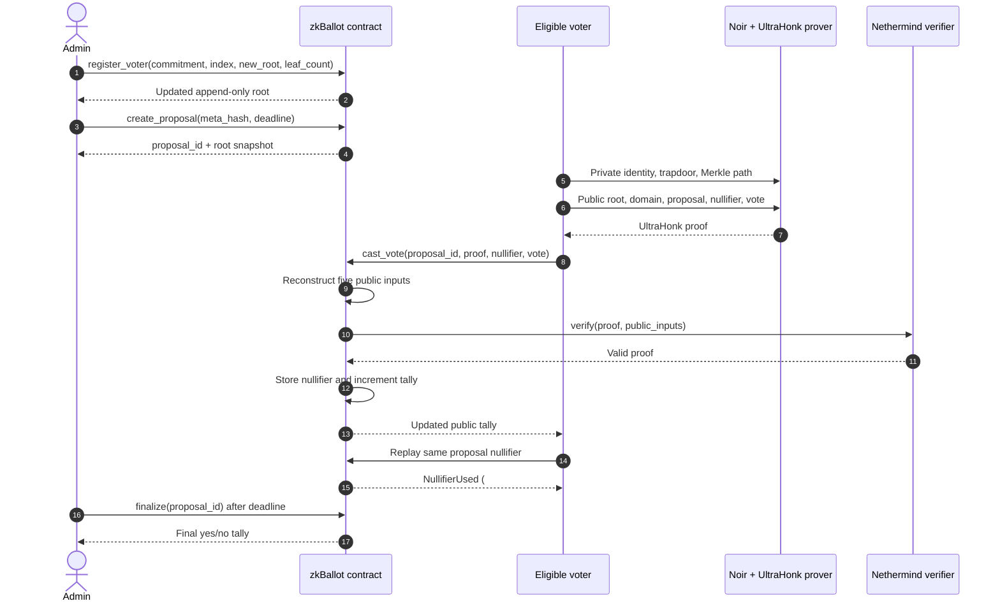
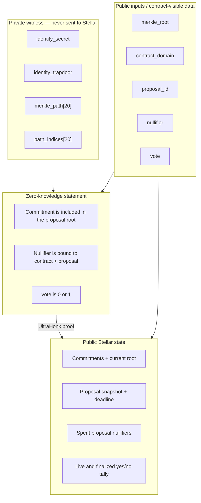

# zkBallot

### Anonymous voter eligibility. Public tally. Verified on Stellar testnet.

zkBallot is a zero-knowledge voting protocol for Stellar. A voter proves that
their identity commitment belongs to an eligible Merkle set without revealing
which registered identity they control. A Soroban smart contract verifies the
UltraHonk proof on-chain, rejects reused proposal nullifiers, and maintains a
transparent binary tally.

> [!IMPORTANT]
> zkBallot provides **anonymous eligibility**, not an encrypted ballot. The
> identity witness and Merkle path are private, but `vote` is a public Noir
> input. The selected vote, proposal-scoped nullifier, and tally are public on
> Stellar.

## Submission at a glance

| Item | Link or result |
| --- | --- |
| Web evidence dashboard | Run locally with `npm run web:dev`, then open `http://localhost:5173` |
| Demo video | [zkballot-demo-video.mp4](./zkballot-demo-video.mp4) — 2:04.8, recorded from the working evidence dashboard |
| Stellar network | Testnet |
| Deployed contract | [`CDDW...Z4V6`](https://stellar.expert/explorer/testnet/contract/CDDW36USNVE3Y2URBH2LXCCLFLFG65BWMHKEXUE23EMBBKOYTKA6Z4V6) |
| Verified lifecycle | 3 voters: `yes / no / yes`; replay rejected; finalized tally `{"no":1,"yes":2}` |
| Proof system | Noir + UltraHonk, `oracle_hash = keccak` |
| On-chain verifier | [Nethermind `rs-soroban-ultrahonk`](https://github.com/NethermindEth/rs-soroban-ultrahonk) |
| Stellar integration | Soroban SDK 26.1.0, contract deployment and proof verification on testnet |

The latest verified testnet run registered three commitments, created a
proposal, accepted three real UltraHonk proofs, rejected a repeated nullifier
with `NullifierUsed (#6)`, and finalized the proposal with
`{"no":1,"yes":2}`.

## Why zkBallot

Traditional public-chain voting creates a difficult trade-off:

- publishing voter accounts links identities to participation;
- trusting an off-chain eligibility service weakens verifiability; and
- accepting votes without a one-person-one-vote mechanism allows replay.

zkBallot separates **eligibility** from **identity disclosure**:

1. An administrator registers identity commitments in an append-only Merkle
   tree.
2. A proposal snapshots the current root.
3. An eligible voter generates a zero-knowledge membership proof off-chain.
4. The contract reconstructs the public inputs and verifies the proof.
5. A proposal-scoped nullifier prevents the same identity from voting twice.
6. The contract updates and later finalizes a public tally.

No trusted voting server decides whether a submitted ballot is valid. The
eligibility rule is enforced by the Noir circuit and the proof is verified by
the Soroban contract before state changes.

## What is implemented

- A depth-20 Poseidon2 Merkle membership circuit in Noir.
- Private identity secret, trapdoor, Merkle path, and path indices.
- A proposal- and contract-bound nullifier construction.
- Binary vote enforcement inside the circuit.
- Canonical 32-byte big-endian BN254 field encoding.
- UltraHonk proof and verification-key generation with a Keccak transcript.
- A Soroban ballot contract using the Nethermind UltraHonk verifier.
- Admin-authorized, append-only voter registration.
- Proposal root snapshots, metadata hashes, deadlines, and finalization.
- Contract-side reconstruction of all five public inputs.
- A random canonical 31-byte contract domain for deployment separation.
- Proposal-scoped double-vote protection.
- Stored-VK and optimized static-VK contract builds.
- Localnet three-voter E2E automation.
- A completed three-voter testnet lifecycle with public transaction evidence.
- A responsive React evidence dashboard and a recorded demo walkthrough.
- Circuit, TypeScript, UI-helper, and Soroban contract tests.

## System architecture



### Component responsibilities

| Component | Responsibility |
| --- | --- |
| Noir circuit | Proves Merkle membership, derives the expected nullifier, and constrains the vote to `0` or `1` |
| TypeScript utilities | Build Poseidon2 Merkle trees, encode BN254 fields, and generate deterministic proof fixtures |
| Barretenberg | Compiles the circuit and creates/verifies UltraHonk proofs with a Keccak transcript |
| Soroban contract | Manages registry/proposals, reconstructs public inputs, invokes the verifier, blocks replay, and updates the tally |
| Nethermind verifier | Verifies the UltraHonk proof inside the Soroban execution environment |
| React dashboard | Presents the verified testnet lifecycle and links every successful state transition to Stellar Expert |

## End-to-end voting workflow



## Privacy and public data boundary



### What remains private

- the identity secret and trapdoor;
- the Merkle authentication path and path indices; and
- which registered leaf generated a valid proof.

### What is public

- the proposal root and registered commitments;
- the contract domain and proposal ID;
- the proposal-scoped nullifier;
- the vote value, `0` or `1`;
- the live yes/no tally; and
- the finalized result and all testnet transactions.

### What zkBallot does not claim

- encrypted or sealed ballots;
- a hidden interim tally;
- unlinkability against all network-level metadata;
- coercion resistance or receipt freeness;
- resistance to a malicious eligibility administrator;
- production audit coverage; or
- mainnet readiness.

## Repository structure

```text
zkballot/
├── artifacts/
│   ├── ballot/                 # Compiled Noir artifact, VK, checksums
│   ├── fixture/                # Reproducible single-voter proof fixture
│   └── e2e/                    # Three-voter E2E proof fixtures
├── circuits/
│   └── ballot/
│       ├── src/main.nr         # Noir membership/nullifier/vote circuit
│       ├── Nargo.toml          # Circuit package and Poseidon dependency
│       └── Prover.toml         # Fixture prover inputs
├── contracts/
│   └── ballot/
│       ├── Cargo.toml          # Soroban workspace configuration
│       └── contracts/ballot/
│           ├── src/lib.rs      # Contract implementation
│           ├── src/test.rs     # Contract unit tests
│           └── Cargo.toml      # Verifier dependency and build features
├── scripts/
│   ├── build-artifacts.sh      # Compile circuit and generate VK
│   ├── generate-proof-inputs.ts
│   ├── prove-fixture.sh        # Generate and natively verify a proof
│   ├── deploy-testnet.sh       # Build and deploy the contract
│   ├── testnet-fixture-demo.sh # Exercise a configured testnet contract
│   └── e2e-localnet.sh         # Full 3-voter localnet lifecycle
├── video-demo/                 # Demo design, storyboard, narration, recorder
├── web/
│   ├── src/App.jsx             # Public testnet evidence dashboard
│   └── src/lib/                # Identity, prover, and Stellar helpers/tests
├── .env.example                # Testnet configuration template
├── package.json                # Root commands and JS dependencies
└── zkballot-demo-video.mp4     # Submission demo video
```

## Circuit design

The circuit is implemented in
[`circuits/ballot/src/main.nr`](./circuits/ballot/src/main.nr) with
`TREE_DEPTH = 20`.

### Identity commitment

```text
commitment = Poseidon2(identity_secret, identity_trapdoor)
```

The circuit recomputes the Merkle root from the private path and constrains it
to equal the public proposal root.

### Proposal-scoped nullifier

```text
external_nullifier =
  Poseidon2(DOMAIN_ZKBALLOT, contract_domain, proposal_id)

nullifier =
  Poseidon2(identity_secret, external_nullifier)
```

`DOMAIN_ZKBALLOT`, the deployed contract domain, and the proposal ID provide
domain separation. The same eligible identity can therefore receive a
different valid nullifier for another proposal, while reuse within the same
proposal is rejected.

### Binary vote constraint

```text
vote == 0 OR vote == 1
```

The circuit checks this constraint, and the contract independently rejects a
calldata vote greater than `1`.

### Public-input order

The order is part of the protocol and must not change independently in the
circuit, proof tooling, or contract:

| Index | Public input | Source used by the contract |
| ---: | --- | --- |
| 0 | `merkle_root` | Proposal root snapshot |
| 1 | `contract_domain` | Contract instance storage |
| 2 | `proposal_id` | `cast_vote` argument |
| 3 | `nullifier` | `cast_vote` argument |
| 4 | `vote` | `cast_vote` argument |

Each value is encoded as one canonical 32-byte, big-endian BN254 scalar. The
contract concatenates the five fields into the verifier input buffer.

## Soroban contract design

The contract implementation is in
[`contracts/ballot/contracts/ballot/src/lib.rs`](./contracts/ballot/contracts/ballot/src/lib.rs).

### Lifecycle and state

| State | Storage | Purpose |
| --- | --- | --- |
| Admin | Instance | Authorizes registry and proposal mutations |
| Contract domain | Instance | Separates nullifiers across deployments |
| Verifying key | Instance or compiled static bytes | Configures UltraHonk verification |
| Current root and leaf count | Instance | Tracks the append-only eligibility tree |
| Commitment index | Persistent | Prevents duplicate registration and records insertion order |
| Proposal | Persistent | Stores root snapshot, metadata hash, deadline, tally, and finalization flag |
| Nullifier marker | Persistent | Blocks reuse for a specific proposal |

Contract instance and persistent entries extend their TTL when accessed.

### Public interface

| Method | Authorization | Behavior |
| --- | --- | --- |
| `__constructor` | Deployment | Stores admin, domain, VK, empty root, and next proposal ID |
| `admin` | Public read | Returns the administrator address |
| `contract_domain` | Public read | Returns the nullifier domain |
| `verifying_key` | Public read | Returns the stored VK |
| `get_root` | Public read | Returns current root and leaf count |
| `register_voter` | Admin | Appends one commitment and updates the root |
| `commitment_index` | Public read | Returns a registered commitment index |
| `create_proposal` | Admin | Snapshots the current root and creates a future deadline |
| `get_proposal` / `proposal` | Public read | Returns proposal state |
| `tally` | Public read | Returns the yes/no tally |
| `has_voted` | Public read | Checks a proposal/nullifier pair |
| `pack_public_inputs_view` | Public read | Exposes canonical verifier input packing |
| `cast_vote` | Public | Validates state, verifies proof, stores nullifier, updates tally |
| `finalize` | Public after deadline | Locks the proposal and returns the final tally |

### Contract errors

| Code | Error | Meaning |
| ---: | --- | --- |
| 1 | `AlreadyInitialized` | Initialization was attempted twice |
| 2 | `NotInitialized` | Required instance state is absent |
| 3 | `ProposalExists` | Reserved proposal collision error |
| 4 | `ProposalMissing` | Proposal ID does not exist |
| 5 | `RootMissing` | Commitment/root lookup failed |
| 6 | `NullifierUsed` | This proposal nullifier has already voted |
| 7 | `InvalidVote` | Vote is not binary |
| 8 | `InvalidPublicInputs` | Reserved public-input validation error |
| 9 | `EmptyProof` | No proof bytes were supplied |
| 10 | `VkParseError` | The verifier could not parse the VK |
| 11 | `ProofParseError` | Reserved proof parsing error |
| 12 | `VerificationFailed` | UltraHonk verification failed |
| 13 | `CommitmentExists` | Commitment is already registered |
| 14 | `NonSequentialIndex` | Registry insertion index is not next |
| 15 | `NonMonotonicLeafCount` | New leaf count is invalid |
| 16 | `PastDeadline` | Proposal deadline is not in the future |
| 17 | `ProposalClosed` | Voting deadline has passed |
| 18 | `Finalized` | Proposal is already finalized |
| 19 | `TooEarlyToFinalize` | Deadline has not been reached |

## UltraHonk verifier integration

The default contract feature uses Nethermind's
[`rs-soroban-ultrahonk`](https://github.com/NethermindEth/rs-soroban-ultrahonk)
at revision:

```text
661db07200f890b1bd9a7349ed787c70a706dd12
```

The circuit artifact, verification key, proof, and public inputs are created
with:

```text
scheme      = ultra_honk
oracle_hash = keccak
```

Two contract build modes are available:

- **Stored VK (default):** constructor stores `vk_bytes` in instance storage.
- **Static VK:** `--features static-vk` embeds
  [`artifacts/ballot/vk`](./artifacts/ballot/vk) into the WASM and removes the
  runtime VK storage read from the verification path.

The latest successful testnet lifecycle used the static-VK build.

## Technology stack

| Layer | Technology |
| --- | --- |
| ZK circuit | Noir 1.0.0-beta.9 |
| Hashing | Poseidon2 |
| Proof system | Barretenberg UltraHonk 0.87.0 |
| Smart contract | Rust + Soroban SDK 26.1.0 |
| On-chain verifier | Nethermind `rs-soroban-ultrahonk` |
| Network tooling | Stellar CLI 27.0.0 |
| Scripts/tests | Node.js 20.20.2, TypeScript, Vitest |
| Demo | React 19 + Vite 7 |
| Local chain | Stellar localnet protocol 26 via Docker |
| Primary development environment | Ubuntu 24.04 on WSL2 |

## Prerequisites

Use Ubuntu/WSL2 for the complete ZK, Rust, Docker, and Stellar workflow.

- Git
- Node.js 20.20.2 and npm
- Rust 1.95.0 with the `wasm32v1-none` target
- Stellar CLI 27.0.0
- Nargo 1.0.0-beta.9
- Barretenberg (`bb`) 0.87.0
- Docker Engine for localnet
- Bash, `curl`, `sha256sum`, `base64`, and `gunzip`

The build scripts download a project-local Linux `jq` 1.7.1 binary when it is
missing. They also establish a Linux-first `PATH` to avoid Windows executable
shims when running inside WSL.

## Quick start

Run from the repository root in WSL:

```bash
npm install

export PATH="$PWD/tools/bin:/usr/local/sbin:/usr/local/bin:/usr/sbin:/usr/bin:/sbin:/bin:$HOME/.bb:$HOME/.nvm/versions/node/v20.20.2/bin:$HOME/.cargo/bin:$HOME/.nargo/bin:$HOME/.local/bin"

# TypeScript utilities and web helpers
npm test

# Noir circuit tests
nargo test --program-dir circuits/ballot

# Compile circuit and generate the UltraHonk VK
npm run build:artifacts

# Generate and natively verify a reproducible proof
npm run fixture:prove

# Soroban contract unit tests
cargo test --manifest-path contracts/ballot/Cargo.toml

# Build default stored-VK contract
(cd contracts/ballot && stellar contract build)

# Build optimized static-VK contract
(cd contracts/ballot && stellar contract build --features static-vk)

# Build the evidence dashboard
npm run web:build
```

## Tests and expected results

| Suite | Command | Current coverage/result |
| --- | --- | --- |
| Noir circuit | `nargo test --program-dir circuits/ballot` | 6 tests: valid proof plus wrong root/domain/proposal/nullifier and non-binary vote rejection |
| TypeScript and web helpers | `npm test` | 22 tests across encoding, Merkle tree, identity, workflow, prover, and Stellar helpers |
| Native proof fixture | `npm run fixture:prove` | Ends with `Proof verified successfully` and checks exact public-input bytes |
| Public-input mutation | `npm run fixture:mutations` | Independently mutates all five public inputs and requires every verification to fail |
| Soroban contract | `cargo test --manifest-path contracts/ballot/Cargo.toml` | 9 tests including authorization and verifier-rejection coverage |
| Localnet lifecycle | `npm run e2e:localnet` | Three proofs accepted, replay rejected, final tally yes=2/no=1 |
| Web production build | `npm run web:build` | Produces static Vite assets in `web/dist` |

The checked-in proof artifacts are protected by SHA-256 manifests:

- [`artifacts/ballot/SHA256SUMS`](./artifacts/ballot/SHA256SUMS)
- [`artifacts/fixture/SHA256SUMS`](./artifacts/fixture/SHA256SUMS)

Verify them from the repository root with:

```bash
sha256sum -c artifacts/ballot/SHA256SUMS
(cd artifacts/fixture && sha256sum -c SHA256SUMS)
```

## Localnet E2E

Start a protocol-26 localnet with unlimited Soroban limits:

```bash
stellar container start local \
  --protocol-version 26 \
  --limits unlimited \
  --name zkballot-localnet
```

Then execute the complete lifecycle:

```bash
npm run e2e:localnet
```

The script:

1. checks localnet health;
2. creates or funds the local administrator;
3. builds the circuit, VK, and static-VK contract;
4. generates three independent UltraHonk proofs;
5. deploys the contract;
6. registers three commitments;
7. creates a proposal from the three-leaf root;
8. casts `yes / no / yes`;
9. verifies that a repeated nullifier fails;
10. checks the live tally;
11. waits for the deadline; and
12. finalizes to `{"no":1,"yes":2}`.

Expected final output:

```text
Tally before finalize: {"no":1,"yes":2}
Final tally: {"no":1,"yes":2}
zkBallot localnet E2E passed: yes/no/yes, double-vote rejected, finalized to (2, 1).
```

## Testnet deployment

### 1. Create and fund a Stellar CLI identity

```bash
stellar keys generate zkballot-deployer --network testnet --fund
stellar keys address zkballot-deployer
```

The first command creates the local CLI identity and funds it through
Friendbot. The second prints the public address used as `ADMIN_ADDRESS`.

### 2. Configure the environment

```bash
cp .env.example .env
```

```dotenv
STELLAR_NETWORK=testnet
STELLAR_SOURCE=zkballot-deployer
ADMIN_ADDRESS=G_YOUR_PUBLIC_ADDRESS
CONTRACT_DOMAIN_HEX=
BALLOT_ID=
```

- `STELLAR_SOURCE` is the local Stellar CLI identity name.
- `ADMIN_ADDRESS` is its `G...` public address.
- Leave `CONTRACT_DOMAIN_HEX` empty to generate a random canonical 31-byte
  field during deployment, or set a previously generated 64-character value
  for reproducibility.
- Never commit secret keys or seed phrases.

### 3. Deploy

Default stored-VK build:

```bash
set -a
source .env
set +a
npm run deploy:testnet
```

Optimized static-VK build:

```bash
set -a
source .env
set +a
STELLAR_BUILD_FEATURES=static-vk \
STELLAR_CONTRACT_ALIAS=zkballot-static-vk \
npm run deploy:testnet
```

Copy the returned contract ID into `BALLOT_ID` in `.env`.

### 4. Run the configured fixture demo

```bash
npm run fixture:prove
npm run demo:testnet
```

## Verified Stellar testnet evidence

**Contract:** [`CDDW36USNVE3Y2URBH2LXCCLFLFG65BWMHKEXUE23EMBBKOYTKA6Z4V6`](https://stellar.expert/explorer/testnet/contract/CDDW36USNVE3Y2URBH2LXCCLFLFG65BWMHKEXUE23EMBBKOYTKA6Z4V6)

| Step | Result | Stellar Expert |
| ---: | --- | --- |
| 1 | Deploy static-VK ballot contract | [Transaction](https://stellar.expert/explorer/testnet/tx/b9ad22820660d3a5c652df0f31c88fd41afadaaeefd98f75e849e5cb2aa51015) |
| 2 | Register voter commitment 0 | [Transaction](https://stellar.expert/explorer/testnet/tx/ad63620d0a7b2019a626ab7d93c6a3e2a531ae557555726008d7451bf3c5ceb3) |
| 3 | Register voter commitment 1 | [Transaction](https://stellar.expert/explorer/testnet/tx/397d28a2a176c590662c91b824b77684778a39658e40b492cea6044d3534cf9f) |
| 4 | Register voter commitment 2 | [Transaction](https://stellar.expert/explorer/testnet/tx/dcefa6e837f2bebfb93828b09d71b9f2a1b6488a6eeb6f61fc53d21a21d3066e) |
| 5 | Create proposal 1 with root snapshot | [Transaction](https://stellar.expert/explorer/testnet/tx/9ce8e9f6e1df231459e3c78c2d0299439262768a28661b09f1247434cd9c8331) |
| 6 | Cast `YES`; proof verified | [Transaction](https://stellar.expert/explorer/testnet/tx/3871a69de3d7bc1fdd8bf2444af3404126acbc945612f5e907e3a3a84b57856c) |
| 7 | Cast `NO`; proof verified | [Transaction](https://stellar.expert/explorer/testnet/tx/499a88e093f8ec8f66a9ccf0748a2ee236bfc2699747931c9e53ee018ffc0fb7) |
| 8 | Cast `YES`; proof verified | [Transaction](https://stellar.expert/explorer/testnet/tx/ecf70f272ffcaa7eab1d8fca49db0ff2db35639ace55d603db4b3c4b29f4ddd4) |
| 9 | Finalize after the deadline | [Transaction](https://stellar.expert/explorer/testnet/tx/0556cd815c84e59c2dc87edd72b9df5c0f21f4053fbec0e20227e371547f870f) |

Replay evidence:

- Reusing voter 0's proposal-scoped nullifier was rejected during simulation
  with `NullifierUsed (#6)`.
- Because the rejected replay did not create a successful state transition,
  there is no successful transaction hash for it.
- The final verified contract state is `finalized = true` and
  `tally = {"no":1,"yes":2}`.

## Demo web application

Start the dashboard:

```bash
npm run web:dev
```

Open [http://localhost:5173](http://localhost:5173). The dashboard presents:

- a four-step guided `Connect → Register → Vote → Results` walkthrough;
- local canonical identity generation and recovery-file export;
- an explicit disclosure that guided controls replay verified evidence rather
  than submitting a new browser-wallet transaction;
- the deployed contract;
- the final tally and replay-rejection result;
- links to all nine successful testnet transactions;
- the private/public ZK data boundary;
- verifier configuration and public-input order; and
- reproducibility commands.

Create a production build:

```bash
npm run web:build
```

The dashboard is currently provided as a local/static build; this README does
not claim a public hosted URL.

## Demo video

The submission video is checked in at
[`zkballot-demo-video.mp4`](./zkballot-demo-video.mp4).

- Duration: **124.800 seconds** (2:04.8).
- Resolution: **1280 × 720**.
- Content: working evidence dashboard, Stellar Expert contract activity,
  successful vote transactions, replay rejection, reproduction commands, and
  the honest privacy boundary.
- Script and capture sources:
  [`video-demo/`](./video-demo/).

## Security model

### Assumptions

- Poseidon2, Noir, Barretenberg UltraHonk, and the verifier behave correctly.
- The circuit artifact and on-chain verification key correspond.
- The administrator registers only eligible commitments and submits correct
  append-only roots.
- Voters keep their identity secrets and trapdoors confidential.
- The client constructs the canonical Merkle path and public inputs.
- Stellar consensus and Soroban state execution remain correct.

### Enforced properties

- A valid proof requires membership in the proposal's snapshotted root.
- The nullifier is derived from the identity secret, contract domain, and
  proposal ID.
- The public vote is binary.
- Contract calldata is bound to the proof through contract-reconstructed public
  inputs.
- A proposal/nullifier pair can mutate the tally only once.
- Voting closes at the deadline and cannot continue after finalization.
- Registry mutation and proposal creation require admin authorization.

### Limitations and threats

- **Public vote:** observers can see individual submitted vote values.
- **Metadata leakage:** transaction sender, timing, IP-level observations, or
  client behavior may reduce practical anonymity.
- **Malicious administrator:** the admin controls the eligibility registry and
  could omit eligible voters or register unauthorized commitments.
- **No encrypted aggregation:** the live tally is visible and may influence
  later voters.
- **No coercion resistance:** a voter may be able to demonstrate how they
  voted through external evidence.
- **Client integrity:** a compromised prover client can leak private witness
  data even though the protocol does not publish it.
- **Preview verifier:** the current verifier integration is suitable for
  hackathon testnet evaluation, not unaudited production deployment.
- **No external audit:** neither the circuit nor contract has received an
  independent security audit.

## Confidential Tokens developer preview

OpenZeppelin and SDF's Confidential Tokens developer preview brings private
balances and transfer amounts to SEP-41 tokens and demonstrates real
Noir/UltraHonk verification on Soroban.

zkBallot uses the same relevant verifier direction through Nethermind's
Soroban UltraHonk backend. It does **not** currently wrap a SEP-41 asset or use
the Confidential Token contract itself.

A future token-governance extension could combine:

- confidential token balances for private voting power;
- zkBallot's proposal membership and nullifier rules; and
- auditable compliance hooks.

That future design would require a new circuit and aggregation model. The
current project intentionally keeps `vote` public and must not be described as
encrypted tallying.

References:

- [OpenZeppelin Stellar contracts preview branch](https://github.com/OpenZeppelin/stellar-contracts/tree/feat/confidential-verifier-ultrahonk)
- [Confidential Tokens preview demo](https://stellar-confidential-token-demo.billowing-moon-0c6f.workers.dev/)

## Troubleshooting

### `vite` is not recognized on Windows

The complete toolchain and existing dependencies are designed for WSL. Run the
commands from Ubuntu in `/mnt/d/dorahack/stellar/zkballot`, or install the npm
dependencies in the active operating system before starting Vite.

### WSL reports `Wsl/Service/0x8007274c`

Restart the WSL service from an elevated PowerShell session, then reopen Ubuntu:

```powershell
wsl --shutdown
```

If the error persists, restart Windows networking or the machine before
continuing the Linux-only proof and contract workflow.

### `jq`, `base64`, or `gunzip` resolves to a Windows shim

Use the documented Linux-first `PATH`. Proof generation depends on Linux
binary behavior and may fail when Windows executables resolve first.

### Localnet is unhealthy

Confirm Docker is running inside WSL, then start the expected container:

```bash
docker version
stellar container start local \
  --protocol-version 26 \
  --limits unlimited \
  --name zkballot-localnet
stellar network health --network local
```

### Proof verification fails

Rebuild the circuit artifact and VK, then regenerate the proof:

```bash
npm run build:artifacts
npm run fixture:prove
```

Do not mix artifacts generated by different Noir, Barretenberg, transcript, or
verifier versions.

### A vote fails with `NullifierUsed (#6)`

The same proposal-scoped nullifier has already voted. Generate a proof from a
different eligible identity. A separate proposal derives a different
nullifier.

## References

- [Stellar developer documentation](https://developers.stellar.org/)
- [Soroban SDK](https://github.com/stellar/rs-soroban-sdk)
- [Noir documentation](https://noir-lang.org/docs/)
- [Barretenberg](https://github.com/AztecProtocol/aztec-packages/tree/master/barretenberg)
- [Nethermind Soroban UltraHonk verifier](https://github.com/NethermindEth/rs-soroban-ultrahonk)
- [Implementation plan](../plans/02-zkBallot-plan.md)

## License

This project is licensed under the [MIT License](./LICENSE).
